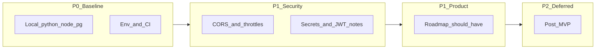

# FastForms — Execution Plan (replanned)

**Last updated:** 2026-03-28  

This document is the **active engineering plan**. It supersedes ad-hoc task lists and aligns with [ExecutionRoadmap.md](ExecutionRoadmap.md) and [SRS.txt](SRS.txt).  

**Scope choices (locked):**

- **No Windows installer work** — Inno Setup, `FastForms-Setup.exe`, bundled runtimes, and installer-specific batch maintenance are **out of scope** unless explicitly requested later.
- **Docker not required** — Local development uses **Python + Node + PostgreSQL** on the machine. A `docker-compose.yml` may exist for others; it is **not** part of this plan’s workflow or scheduled work.

---

## Related documents

| Document | Role |
|----------|------|
| [ExecutionRoadmap.md](ExecutionRoadmap.md) | Phases, backlog themes, risks |
| [SRS.txt](SRS.txt) | Requirements and acceptance framing |
| [RUN_ON_NEW_SYSTEM.md](RUN_ON_NEW_SYSTEM.md) | Optional: manual setup on a new PC (no installer) |
| [README.md](../README.md) | Primary run instructions |

---

## Priority overview

---

## P0 — Baseline (do first)

| ID | Task | Outcome | Primary locations |
|----|------|---------|-------------------|
| P0-1 | **Local stack sanity** | README “happy path” works: backend `pip` + `migrate` + `runserver`; frontend `npm install` + `npm run dev`. | [README.md](../README.md) |
| P0-2 | **PostgreSQL + `.env`** | `backend/.env` matches [settings.py](../backend/config/settings.py); DB/user creation documented for local Postgres. | [backend/.env.example](../backend/.env.example), [RUN_ON_NEW_SYSTEM.md](RUN_ON_NEW_SYSTEM.md) |
| P0-3 | **CI** | [ci.yml](../.github/workflows/ci.yml) stays green: backend tests, frontend build. | `.github/workflows/ci.yml` |

---

## P1 — Security (recommended branch: `Security` or `feature/security`)

| ID | Task | Outcome | Primary locations |
|----|------|---------|-------------------|
| S1 | **CORS** | Replace allow-all with env-driven allowed origins when `DEBUG=False`; permissive in dev only. | [backend/config/settings.py](../backend/config/settings.py) |
| S2 | **Auth throttles** | Stricter limits on login/register/token refresh vs global defaults. | JWT / auth URLs under [backend/apps/](../backend/apps/) |
| S3 | **Secrets** | Strong `DJANGO_SECRET_KEY` and DB passwords only via env; never committed. | `.env.example`, docs |
| S4 | **JWT** | Review lifetimes; optional refresh rotation / blacklist (SimpleJWT); document XSS + storage risks. | [settings.py](../backend/config/settings.py), [frontend/src/api.js](../frontend/src/api.js) |
| S5 | **Production hardening (doc + settings)** | When HTTPS: `DEBUG=False`, tight `ALLOWED_HOSTS`, Django security flags (`SECURE_*`, cookies, HSTS as appropriate). **Document** reverse proxy (nginx/Caddy). | settings, README or Docs |
| S6 | **Dependency hygiene** | Optional CI job or periodic `pip audit` / `npm audit`. | `requirements.txt`, `package.json` |

**Optional:** add `Docs/SECURITY.md` (threat model, auth, data handling).

---

## P1 — Product (roadmap “Should Have”)

| ID | Task | Notes |
|----|------|--------|
| PR1 | **Password reset** | Email + token endpoints; frontend flow. |
| PR2 | **Response search/filter** | API query params + UI on list/analytics views. |
| PR3 | **Stronger question validation** | Regex/range/date bounds (model + serializer). |
| PR4 | **Celery / notifications** | Document local `celery -A config worker` when Redis is available; eager mode for tests. |

---

## P2 — Post-MVP (defer unless requested)

- Real-time collaborative editing, AI-assisted forms, advanced integrations ([ExecutionRoadmap.md](ExecutionRoadmap.md) P2).
- E2E tests (Playwright/Cypress) for creator + respondent journeys.

---

## Suggested sprints

1. **Sprint A:** P0 (README path, `.env`, CI).
2. **Sprint B:** P1 Security (S1–S4 minimum; S5–S6 as time allows).
3. **Sprint C:** P1 Product (PR1 → PR2 → PR3; PR4 docs as needed).

---

## Explicitly out of scope (unless you reopen)

- Windows installer / Inno / EXE / bundled Python/Node/Postgres.
- Docker / Compose as a required or planned workflow.

---

## Out of scope unless requirements are added

- Full JWT → session cookie migration.
- SOC2/GDPR program work without explicit requirements.

---

## Tracking checklist (copy for issues)

- [x] P0-1 Local stack verified
- [x] P0-2 `.env` + Postgres documented (`backend/.env.example`, README)
- [x] P0-3 CI green (SQLite in CI)
- [x] S1 CORS
- [x] S2 Auth throttles
- [x] S3 Secrets discipline
- [x] S4 JWT review (rotation + blacklist)
- [x] S5 Production settings + proxy doc (`Docs/SECURITY.md`)
- [x] S6 Dependency audits (optional pip-audit step in CI)
- [x] PR1 Password reset
- [x] PR2 Filters
- [x] PR3 Validation rules
- [x] PR4 Celery doc (`Docs/CELERY.md`)
