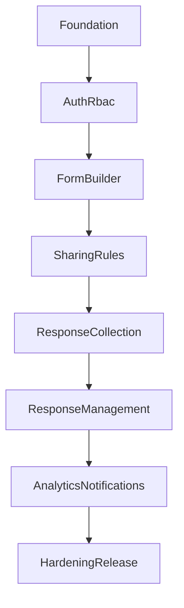

# FastForms Execution Roadmap

## 1. Delivery Strategy
Build in dependency order: identity -> form schema -> submissions -> reporting -> platform hardening.

## 2. Phase Plan

### Phase 0: Foundation (Week 1)
Scope:
- Repository bootstrap (backend/frontend), environment config, Docker compose skeleton.
- CI baseline (lint + test jobs).
- Shared API error format and logging standard.

Definition of Done:
- Team can run local stack with one command.
- CI runs on default branch.

### Phase 1: Auth and RBAC (Weeks 2-3)
Scope:
- Register/login/refresh/password reset.
- Role model and authorization middleware/policies.
- Protected route setup in frontend.

Definition of Done:
- AC-001 and AC-007 pass.

Risks:
- Role leakage due to incomplete endpoint guards.

### Phase 2: Form Builder Core (Weeks 3-5)
Scope:
- Form CRUD, draft/publish, question CRUD, reorder questions.
- Supported question types for MVP.
- Builder UI with create/edit/preview flow.

Definition of Done:
- AC-002 passes.
- Creator can publish and share a form URL.

Risks:
- Question schema changes can break response compatibility.

### Phase 3: Sharing and Response Collection (Weeks 5-6)
Scope:
- Public/private access settings.
- One-response-per-user and open/close date rules.
- Submission API and frontend respondent flow.

Definition of Done:
- AC-003 and AC-004 pass.

Risks:
- Duplicate submission race conditions.

### Phase 4: Response Management and Exports (Weeks 6-7)
Scope:
- Response summary + detail views.
- Search/filter APIs.
- CSV/JSON export endpoints.

Definition of Done:
- AC-005 passes.

Risks:
- Large export memory usage.

### Phase 5: Analytics and Notifications (Weeks 7-8)
Scope:
- Aggregation service and analytics endpoint.
- Dashboard charts.
- New response and confirmation emails.

Definition of Done:
- AC-006 passes.

Risks:
- Slow aggregates without caching/indexing.

### Phase 6: Hardening and Release (Weeks 8-9)
Scope:
- Performance testing and optimization.
- Security checks (rate limits, upload restrictions, audit logs).
- Backup/restore runbook and release checklist.

Definition of Done:
- AC-008 passes.
- Production readiness checklist signed off.

## 3. Prioritized Engineering Backlog

## P0 (Must Have for MVP)
- Backend auth endpoints and JWT middleware.
- User role model and endpoint authorization checks.
- Form, Question, Response, Answer core models and migrations.
- Form/question CRUD and reorder endpoints.
- Submission endpoint with required validation.
- One-response-per-user enforcement.
- Response listing and detail endpoints with pagination.
- CSV/JSON export support.
- Basic analytics endpoint (count + per-question aggregates).
- Frontend auth pages, protected routing, builder page, public submit page.

## P1 (Should Have)
- Password reset email flow.
- Notifications for submissions.
- Search and filtering in response dashboard.
- Improved validation rules (regex/range/date bounds).
- Admin moderation tools.

## P2 (Could Have / Post-MVP)
- Real-time collaborative editing.
- AI-assisted form generation.
- Advanced analytics and external integrations.

## 4. Cross-Cutting Quality Tasks
- Add API contract tests for critical endpoints.
- Add end-to-end tests for creator and respondent journeys.
- Add observability: request IDs, structured logs, health checks.
- Add performance benchmark suite for submission and response listing.
- Add security checks: upload validation, rate limiting, auth brute-force protections.

## 5. Dependency Graph (Simplified)

## 6. Test Gate by Acceptance Criteria
- Gate A: AC-001, AC-007 (after Phase 1)
- Gate B: AC-002 (after Phase 2)
- Gate C: AC-003, AC-004 (after Phase 3)
- Gate D: AC-005 (after Phase 4)
- Gate E: AC-006 (after Phase 5)
- Gate F: AC-008 (after Phase 6)
